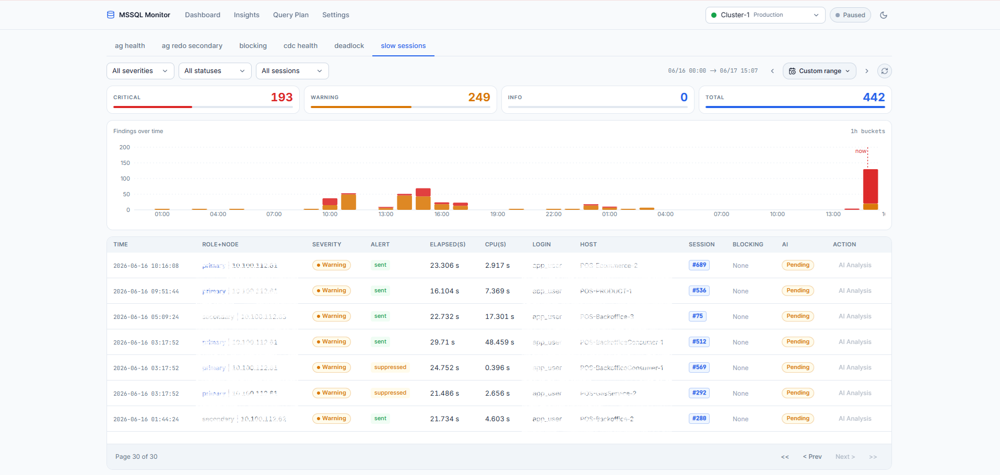
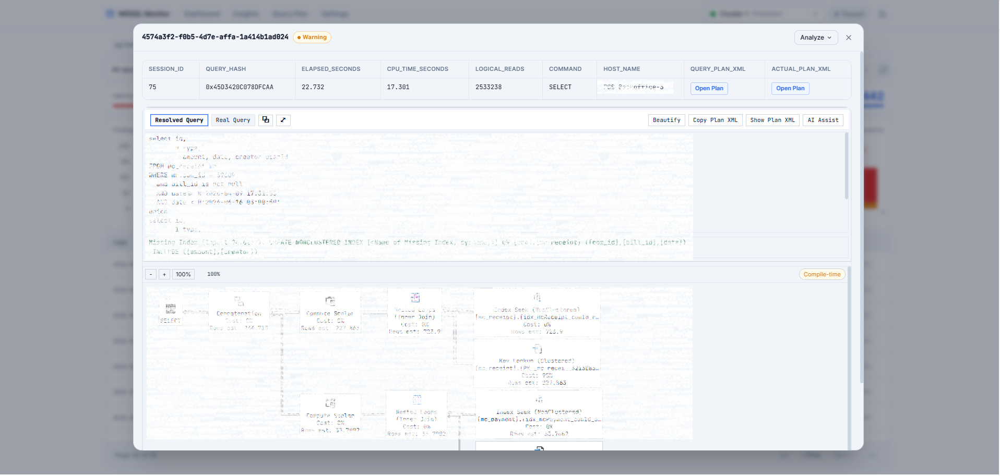
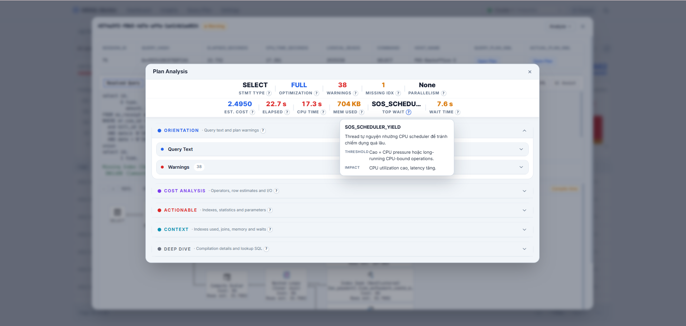
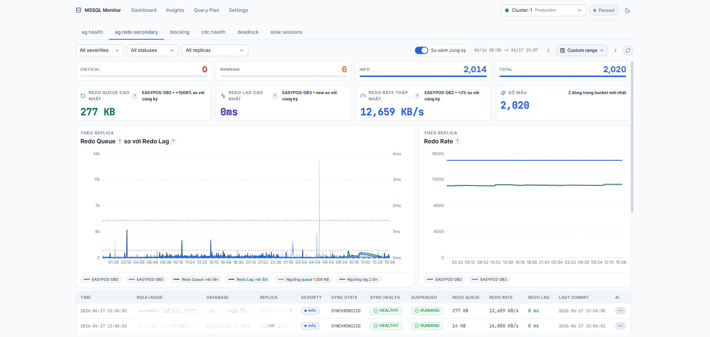

# AI-Automation-MSSQL

Hệ thống tự động giám sát và phân tích sự cố cho **nhiều cụm MSSQL Server 2019 Enterprise Always On Availability Groups** (multi-cluster).

**Status:** ✅ Production-ready (Layer 1 + Layer 2 + Layer 3 + Maintenance)

---

## 🖼️ Screenshots

<table>
  <tr>
    <td align="center"><b>Dashboard</b></td>
    <td align="center"><b>Slow Session Detail</b></td>
  </tr>
  <tr>
    <td></td>
    <td></td>
  </tr>
  <tr>
    <td align="center"><b>Query Plan Analysis</b></td>
    <td align="center"><b>AG Redo Secondary</b></td>
  </tr>
  <tr>
    <td></td>
    <td></td>
  </tr>
</table>

---

## 📋 Overview

**Problem:** Nhiều cụm MSSQL Always On AG, mỗi cụm 1 Primary + 2 Secondary, dữ liệu lớn, CDC capture, partition tables — cần giám sát liên tục, phân tích sự cố real-time, và dashboard trực quan.

**Solution:** 3-layer architecture + 1 maintenance process độc lập:

- **Layer 1** — Python monitoring service: config-driven, multi-cluster, thay đổi query/threshold không cần redeploy
- **Layer 2** — FastAPI + Claude AI + Telegram bot: on-demand analysis khi user yêu cầu
- **Layer 3** — Web UI (React SPA): findings, insights, query plan, **maintenance control plane**
- **Maintenance** — process riêng (`maintenance/`): Catalog snapshot → Campaign → Discovery → Execute index/statistics/heap trong window đêm. Điều khiển qua Layer 3 (MongoDB), DBA duyệt qua Telegram.

**Quản lý cụm qua MongoDB** — thêm/bật/tắt cluster không cần redeploy.

---

## 🏗️ Architecture

```
MongoDB db_clusters (cluster config)
MongoDB monitor_topics (topic config)
         │
         ▼
Layer 1 — APScheduler (max_workers=50)
  └─ 1 job per (cluster_id, topic_id)
       │
       ├─ Resolve nodes từ NodeRoleCache (AG role auto-detect)
       ├─ Execute queries parallel per node
       ├─ Detect: threshold / baseline / blocking_chain / plan_analysis
       ├─ Save findings (cluster_id, node, metrics)
       └─ Notify: Telegram / Teams
         │
         ▼
Layer 2 — FastAPI + Claude AI
  └─ /analyze → AgentOrchestrator → Claude Sonnet → insights
       │
       ▼
Layer 3 — Fastify API + React SPA (web-v2)
  └─ Dashboard: findings, metrics, insights, query plan
  └─ Maintenance control plane → ghi MongoDB (config/campaign/command)
       │
       ▼
Maintenance runner (process riêng, KHÔNG có HTTP)
  └─ poll MongoDB → Catalog snapshot → Discovery (campaign) → batch approval (Telegram)
       → Execute trong window đêm (gates) → maintenance_history
```

**Thêm/sửa query hoặc threshold:** Edit MongoDB `monitor_topics` → có hiệu lực ngay lần chạy kế tiếp, không cần restart.

---

## 📁 Project Structure

```
AI-Automation-MSSQL/
├── layer1/                    # Python monitoring service
│   ├── scheduler.py           # Entry point + APScheduler
│   ├── config.py              # EnvSettings (env vars only)
│   ├── executor/              # SQL executor + NodeRoleCache
│   ├── detectors/             # Registry: threshold, baseline, plan_analysis, blocking_chain
│   ├── storage/               # MongoDB repositories
│   ├── notifications/         # Telegram bot + Teams notifier
│   ├── ai/                    # Claude Haiku (/quick command)
│   ├── services/              # Kill session / blocking actions
│   ├── api/                   # REST API (clusters, health, kill-session)
│   ├── job_manager/           # Job execution tracking + health checker
│   ├── seed/                  # Seed monitor_topics vào MongoDB
│   └── CLAUDE.md
│
├── maintenance/               # Maintenance runner — PROCESS RIÊNG (python -m maintenance.runner)
│   ├── runner.py              # APScheduler: catalog/discovery/tick/summary jobs + command poll
│   ├── catalog/               # Snapshot scope (db/schema/table) → maintenance_catalog
│   ├── discovery/             # Catalog → maintenance_queue (per-partition, per-campaign)
│   ├── execute/               # Tick loop: gates → claim → REBUILD/REORG/UPDATE STATS
│   ├── policy/ window/ safety/ # Execution params, window VN-time, CPU/AG gates
│   ├── notify/                # Telegram batch approval + nightly summary
│   ├── models/ repositories/  # Pydantic docs (catalog, campaign, thresholds, work_item) + Mongo access
│   ├── seed/seed_maintenance.py
│   ├── CLAUDE.md
│   └── ARCHITECTURE.md        # Cơ chế chi tiết: catalog↔campaign, threshold resolution, lifecycle
│
├── layer2/                    # FastAPI + Claude AI analysis
│   ├── main.py                # FastAPI app entry point
│   ├── agent/                 # AgentOrchestrator, SkillLoader, ToolRegistry
│   ├── plan/                  # Execution plan analysis engine (pure Python)
│   ├── analysis/              # Pipeline abstraction
│   ├── executor/              # DiagnosticExecutor, node_role_cache
│   ├── storage/               # MongoDB: ai_analyses, issue_insights, sessions
│   ├── notifications/         # Telegram bot (/analyze + multi-turn)
│   ├── api/routes/            # analysis, plan, insights, skills, health
│   ├── skills/                # 14 YAML skill files
│   ├── db_business_context.yaml
│   └── CLAUDE.md
│
├── layer3/                    # Web UI (control plane)
│   ├── apps/api/              # Fastify backend (proxy + MongoDB reads/writes + JSON-schema validation)
│   │   └── src/               # routes (findings, plan, maintenance, catalog, campaigns, ...), services, schemas
│   ├── apps/web-v2/           # React + Vite + React Query + Zustand SPA
│   │   └── src/               # pages (Dashboard, QueryPlan, Maintenance{Campaign,Catalog}), components, hooks
│   └── CLAUDE.md
│
├── Dockerfile                 # Layer 1 + Maintenance image (cùng Python codebase)
├── Dockerfile.layer2          # Layer 2 image
├── docker-compose.yml         # services: layer1, maintenance, layer2, layer3, mongodb
├── .env.example
└── CLAUDE.md                  # Root architecture overview
```

---

## 🚀 Quick Start

### Prerequisites

- Docker + Docker Compose
- MSSQL Server 2019 (AG cluster hoặc standalone cho test)
- MongoDB 6+
- Telegram bot token (optional)
- Anthropic API key (optional, cho AI analysis)

### 1. Setup Environment

```bash
cp .env.example .env
cp layer3/.env.example layer3/.env
```

Chỉnh `.env` với thông tin thực tế (xem phần Environment Variables bên dưới).

### 2. Seed MongoDB

```bash
# Chạy 1 lần khi setup lần đầu
docker compose run --rm layer1 python -m layer1.seed.seed_topics

# Maintenance: seed default policy + window (chạy trước khi start maintenance runner)
docker compose run --rm maintenance python -m maintenance.seed.seed_maintenance
```

### 3. Build & Run

```bash
# Build
docker build -t myorg/ai-automation-mssql:v1.0.0 .
docker build -f Dockerfile.layer2 -t myorg/ai-automation-mssql-layer2:v1.0.0 .

# Start
docker compose up -d

# Verify
docker compose ps
docker compose logs -f layer1
```

### 4. Thêm cluster mới

Qua REST API của Layer 1:

```bash
curl -X POST http://localhost:8001/clusters \
  -H "Content-Type: application/json" \
  -d '{
    "cluster_id": "prod",
    "name": "Production",
    "environment": "production",
    "nodes": ["10.0.1.10", "10.0.1.11", "10.0.1.12"],
    "port": 1433,
    "database": "AppDatabase",
    "username": "sa_monitor",
    "password": "...",
    "color": "#2563eb"
  }'
```

Cluster được enable ngay — Layer 1 tự detect AG role và bắt đầu chạy jobs.

---

## 🔧 Environment Variables

### Layer 1 (`.env`)

| Variable | Mô tả | Ví dụ |
|---|---|---|
| `MONGODB_URI` | MongoDB connection string | `mongodb://mongodb:27017` |
| `MONGODB_DB` | MongoDB database | `db_monitor` |
| `MSSQL_NODES` | Legacy seed nodes (optional) | `10.0.1.10,10.0.1.11,10.0.1.12` |
| `MSSQL_DATABASE` | Legacy seed database (optional) | `AppDatabase` |
| `MSSQL_USERNAME` | Legacy seed username (optional) | `sa_monitor` |
| `MSSQL_PASSWORD` | Legacy seed password (optional) | _(secret)_ |
| `NODE_ROLE_REFRESH_SEC` | AG role cache refresh interval | `3600` |
| `CLUSTER_REFRESH_SEC` | Cluster config reload interval | `60` |
| `DEDUP_SUPPRESS_MINUTES` | Alert dedup window | `30` |
| `TELEGRAM_BOT_TOKEN` | Layer 1 bot token (optional) | _(secret)_ |
| `TELEGRAM_CHAT_ID` | Telegram chat ID (optional) | `1234567890` |
| `ACTION_BOT_TOKEN` | Bot gửi action result (optional) | _(secret)_ |
| `TEAMS_WEBHOOK_URL` | Teams webhook (optional) | _(secret)_ |
| `CLAUDE_API_KEY` | Claude API key cho /quick | _(secret)_ |
| `HAIKU_MODEL` | Model cho /quick (nhanh, rẻ) | `claude-haiku-4-5-20251001` |
| `LAYER2_URL` | Layer 2 internal URL | `http://layer2:8000` |
| `LOG_LEVEL` | Log level | `INFO` |

### Layer 2 (`.env.layer2`)

| Variable | Mô tả | Ví dụ |
|---|---|---|
| `MONGODB_URI` | MongoDB (dùng chung với Layer 1) | `mongodb://mongodb:27017` |
| `L2_TELEGRAM_BOT_TOKEN` | Layer 2 bot token (khác Layer 1) | _(secret)_ |
| `CLAUDE_API_KEY` | Claude API key cho analysis | _(secret)_ |
| `CLAUDE_MODEL` | Model cho analysis | `claude-sonnet-4-6` |

### Layer 3 (`layer3/.env`)

| Variable | Mô tả | Ví dụ |
|---|---|---|
| `MONGODB_URI` | MongoDB | `mongodb://mongodb:27017` |
| `L1_API_URL` | Layer 1 API URL | `http://layer1:8001` |
| `L2_API_URL` | Layer 2 API URL | `http://layer2:8000` |
| `ACTION_BOT_TOKEN` | Token xác thực kill-session | _(secret)_ |

### Maintenance (dùng chung `.env`)

| Variable | Mô tả | Ví dụ |
|---|---|---|
| `MONITOR_MONGODB_DB` | DB đọc `db_clusters` | `db_monitor` |
| `MAINT_MONGODB_DB` | DB ghi catalog/campaign/queue/history | `db_maintenance` |
| `MAINT_CATALOG_CRON` | Lịch snapshot scope | `0 6 * * *` |
| `MAINT_SUMMARY_CRON` | Lịch nightly summary | `30 5 * * *` |
| `MAINT_TICK_SEC` | Chu kỳ execute tick | `60` |
| `MAINT_DRY_RUN` | `true` = chỉ log T-SQL; `false` khi go-live | `true` |
| `MAINT_MAX_ATTEMPTS` | Số lần retry item lỗi | `3` |
| `MAINT_APPROVAL_EXPIRE_HOURS` | Thời hạn batch approval | `30` |
| `MAINT_BATCH_TOP_N_ITEMS` | Số item hiển thị trong batch Telegram | `10` |
| `MAINT_CATALOG_MAX_WORKERS` | Parallel capture bảng | `8` |
| `MAINT_CATALOG_TABLE_TIMEOUT_SEC` | Timeout per-table khi catalog capture | `120` |
| `MAINT_ESTIMATE_PAGES_PER_MINUTE` | Tốc độ ước lượng thời gian REBUILD/REORGANIZE | `150000` |
| `MAINT_ESTIMATE_ROWS_PER_MINUTE` | Tốc độ ước lượng UPDATE STATS / HEAP REBUILD | `2000000` |
| `MSSQL_QUERY_TIMEOUT_SEC` | Query timeout cho execute tick | `30` |
| `MAINT_TELEGRAM_BOT_TOKEN` | Bot RIÊNG của maintenance (poll approval) | _(secret)_ |
| `TELEGRAM_CHAT_ID` | Chat ID (dùng chung biến với Layer 1) | `1234567890` |

---

## 📊 Monitoring Topics (Layer 1)

Cấu hình trong MongoDB `monitor_topics` — thêm/sửa không cần redeploy:

| Topic | Mô tả | Target |
|---|---|---|
| `slow_sessions` | Session chạy lâu, blocking | PRIMARY |
| `blocking` | Blocking chains, head blocker | PRIMARY |
| `deadlock` | Deadlock detection | PRIMARY |
| `ag_health` | AG replica health, sync state | ALL |
| `ag_redo_secondary` | Redo queue lag trên secondary | SECONDARY |
| `tempdb` | TempDB version store, space | PRIMARY |
| `resource_governor` | CPU/memory per resource pool | PRIMARY |
| `missing_indexes` | Missing indexes từ plan cache | PRIMARY |
| `index_fragmentation` | Index fragmentation | PRIMARY |

Mỗi topic có: SQL query, detector type, threshold/baseline config, schedule interval, target nodes.

---

## 🤖 AI Analysis (Layer 2)

**Từ Telegram:**
- `/analyze <finding_id>` — Claude Sonnet phân tích sâu, gửi kết quả về chat
- Reply vào alert message → tự động phân tích finding đó

**Từ Layer 3 UI:**
- Click "Analyze" trên finding → gọi Layer 2 API → hiển thị insights

**Execution plan analysis:**
- Paste XML plan vào Query Plan page → Layer 2 parse + phân tích 10 dimensions

---

## 🛠️ Maintenance (Index / Statistics / Heap)

Process riêng (`maintenance/`) bảo trì index/statistics/heap an toàn trong window đêm, điều khiển từ Layer 3.

**Luồng:**
1. **Catalog** — runner snapshot scope (db/schema/table do DBA cấu hình ở tab Catalog) vào `maintenance_catalog`, gồm fragmentation per-partition, stats modification, heap forwarded records.
2. **Campaign** — DBA tạo campaign ở Layer 3: chọn bảng, execution types (index/statistic/heap), **ngưỡng theo từng loại** (trống = dùng default), window override, lịch `scan_times`.
3. **Discovery** — runner so catalog snapshot mới nhất với ngưỡng campaign → sinh work items (**1 item / partition vượt ngưỡng**) → gửi batch lên Telegram.
4. **Approval** — DBA bấm ✅/⛔ trên Telegram.
5. **Execute** — trong window đêm: safety gates (CPU, AG redo/send queue) → claim theo priority → REORGANIZE / REBUILD [PARTITION] ONLINE RESUMABLE / UPDATE STATISTICS / HEAP REBUILD → ghi `maintenance_history`.

**Đặc điểm:**
- Catalog (đo lường) tách khỏi Campaign (hành động) — đổi ngưỡng không cần capture lại.
- Campaign ACTIVE **re-discover hằng ngày** theo capture mới nhất; item cũ chưa chạy bị supersede.
- Runner KHÔNG có HTTP — Layer 3 ghi MongoDB; force-run ngay qua `maintenance_commands` (nút trong UI).
- `MAINT_DRY_RUN=true` để chạy thử (chỉ log T-SQL) trước khi go-live.

Chi tiết: `maintenance/CLAUDE.md` + `maintenance/ARCHITECTURE.md`.

---

## 🔐 Security

- SQL login (`sa_monitor`) chỉ cần `SELECT` trên DMVs + quyền `KILL` session
- Credentials lưu trong `.env` — không commit vào git (`.gitignore`)
- `ACTION_BOT_TOKEN` bảo vệ kill-session endpoint
- Không log password, API key, hay session content

---

## 📝 Key Design Decisions

| Quyết định | Lý do |
|---|---|
| **Config-driven** (MongoDB) | Thêm/sửa query không cần redeploy |
| **Node role auto-detect** | AG failover transparent |
| **Job per `(cluster_id, topic_id)`** | Cụm lỗi không block cụm khác |
| **APScheduler `max_workers=50`** | N cụm × M topics đồng thời; I/O-bound |
| **Không replace job đang chạy** | Giữ `max_instances=1` hiệu lực; tránh stuck accumulation |
| **`cluster_id` trong findings** | Dữ liệu multi-cluster không lẫn nhau |
| **`_refresh_all_node_roles` ngoài lock** | Timeout 1 cụm không block cụm khác |
| **TRÁNH `OPTION(OPTIMIZE FOR UNKNOWN)`** | Gây CPU overload khi throughput cao |
| **Day-of-week baseline** | Workload pattern khác nhau theo ngày trong tuần |
| **Maintenance là package riêng, IPC qua MongoDB** | Tách khỏi monitoring; runner không cần HTTP; Layer 3 ghi config/command |
| **Catalog (đo lường) tách khỏi Campaign (hành động)** | 1 snapshot dùng nhiều campaign; ngưỡng ở campaign, đổi không cần capture lại |
| **1 work item / partition vượt ngưỡng** | REBUILD/REORG chính xác từng partition cho bảng partition |
| **Re-discover hằng ngày + supersede** | Campaign ACTIVE bám last capture; không chạy lại catalog cũ |

---

## 🐛 Troubleshooting

### Layer 1 không connect được MSSQL

```bash
docker compose logs layer1 | grep -E "Role detection|Connection failed|cluster="
```

Kiểm tra `db_clusters` trong MongoDB — xem `nodes`, `database`, `username` đúng chưa.

### Job stuck / MISSED schedule

```bash
docker compose logs layer1 | grep -E "STUCK|MISSED"
```

Job stuck thường do SQL Server không respond. Cụm healthy vẫn chạy bình thường. Nếu cụm lỗi liên tục — disable tạm trong MongoDB Settings.

### Kill session lỗi từ Telegram / Layer 3

```bash
docker compose logs layer1 | grep "kill_session"
```

Nguyên nhân thường gặp: `cluster_id` không có trong request → dùng sai credentials. Đảm bảo Layer 3 gửi `cluster_id` khi call `/kill-session`.

### Layer 3 báo 502

```bash
docker compose logs layer3
curl http://localhost:8001/health
```

---

## 🚢 Deployment

```bash
# Build & push
docker build -t myorg/ai-automation-mssql:v2.0.0 .
docker build -f Dockerfile.layer2 -t myorg/ai-automation-mssql-layer2:v2.0.0 .
docker push myorg/ai-automation-mssql:v2.0.0
docker push myorg/ai-automation-mssql-layer2:v2.0.0

# Server — pull và restart từng service độc lập
docker compose pull layer1 && docker compose up -d layer1
docker compose pull layer2 && docker compose up -d layer2
docker compose pull layer3 && docker compose up -d layer3
docker compose pull maintenance && docker compose up -d maintenance
```

> Service `maintenance` build từ cùng codebase Python (`Dockerfile`), tag image riêng
> (`…-maintenance`), entry `python -m maintenance.runner`. `stop_grace_period: 30s` để PAUSE
> resumable rebuild khi SIGTERM.

---

## 📄 About

**Author:** Long Do — Backend Engineering — longdt@softdreams.vn

**License:** Internal project — SoftDreams company.

**Third-party:** SQL parsing powered by [sqlparse](https://github.com/andialbrecht/sqlparse) © Andi Albrecht, BSD License.
